# Computer Vision - HW04 - 98722278
Index:

1. Canny Edge Detector
    1. Gaussian Noise
    2. Gradient Intensification
    3. Non-Max Suppression
    4. Thresholding
2. Straight Line Detector
    1. Assign each edge to a direction
    2. Getting edgelets using connected components
    3. Compute straightness and theta
    4. Threshold
    5. Test

## 1 Implementation of Canny Edge Detector
1. Gaussian Noise
2. Gradient Intensification
3. Non-Max Suppression
4. Thresholding


```python
import cv2
import numpy as np
from scipy import ndimage
from PIL import Image

import matplotlib.pyplot as plt

import time
%matplotlib inline
```


```python
def open_image(path):
    """
    Open an image using PIL library

    :param path: path to image file-like
    :return: PIL image object
    """
    image = Image.open(path)
    return image

```


```python
def show_image(image, cmap='gray'):
    """
    Show PIL image or numpy image in default viewer of OS

    :param image: image data
    :param cmap: color map of input numpy array
    :return: None
    """
    if str(type(image)).__contains__('PIL'):
        image.show()
    elif str(type(image)).__contains__('numpy'):
        if cmap=='gray':
            Image.fromarray(np.uint8(image), mode='L').show()
        elif cmap == 'bw':
            size = image.shape[::-1]
            data_bytes = np.packbits(image, axis=1)
            Image.frombytes(mode='1', size=size, data=data_bytes).show()
        else:
            raise ValueError('color map is invalid.')
    else:
        raise ValueError('Input t is not valid.')
```


```python
class ToGrayscale:
    """
    Get and PIL image or numpy n-dim array as image and convert it to grayscale image
    """

    def __init__(self):
        pass

    def __call__(self, image):
        """
        Get and PIL image or numpy n-dim array as image and convert it to grayscale image

        :param image: input image data
        :return: Grayscale image of input type
        """
        if str(type(image)).__contains__('PIL'):
            image = image.convert('L')
        elif str(type(image)).__contains__('numpy'):
            image = np.dot(image[..., :3], [0.2989, 0.5870, 0.1140])
        else:
            raise ValueError('Input type is not valid.')
        return image
```

### 1.A Gaussian Noise


```python
class GaussianNoise:
    def __init__(self, size=5, std=1):
        self.size = size
        self.std = std

    def _gaussian(self, r2):
        """
        Sample one instance from gaussian distribution regarding
        given squared-distance:r2, standard-deviation:std and general-constant:k

        :param r: squared distance from center of gaussian distribution
        :param std: standard deviation

        :return: A sampled number obtained from gaussian
        """
        return np.exp(-r2/(2.*self.std**2)) / (2.*np.pi*self.std**2)

    def _gaussian_kernel(self):
        """
        Creates a gaussian kernel regarding given size and std.
        Note that to define interval with respect to the size,
        I used linear space sampling which may has
        lower accuracy from renowned libraries.

        :param std: standard deviation value
        :param size: size of the output kernel
        :return: A gaussian kernel with size of (size*size)
        """
        self.size = int(self.size) // 2
        x, y = np.mgrid[-self.size:self.size+1, -self.size:self.size+1]
        distance = x**2+ y**2
        kernel = self._gaussian(r2=distance)
        return kernel

    def __call__(self, image):
        """
        Applies gaussian noise on the given image

        :param image: Input image in grayscale mode numpy ndarray or cv2 image
        :param size: Size of the gaussian kernel
        :param std: Standard deviation value for gaussian kernel
        """

        return ndimage.convolve(image, self._gaussian_kernel())

```


```python
image = cv2.imread('images/cameraman.jpg', cv2.IMREAD_GRAYSCALE)
gaussian_noise = GaussianNoise()
image_blurred = gaussian_noise(image)

# plotting
fig, ax = plt.subplots(nrows=1, ncols=2, figsize=(20, 15))
ax[0].set_title('original')
ax[1].set_title('blurred')
ax[0].imshow(image, cmap='gray')
ax[1].imshow(image_blurred, cmap='gray')
```


    <matplotlib.image.AxesImage at 0x17c7aad22e8>


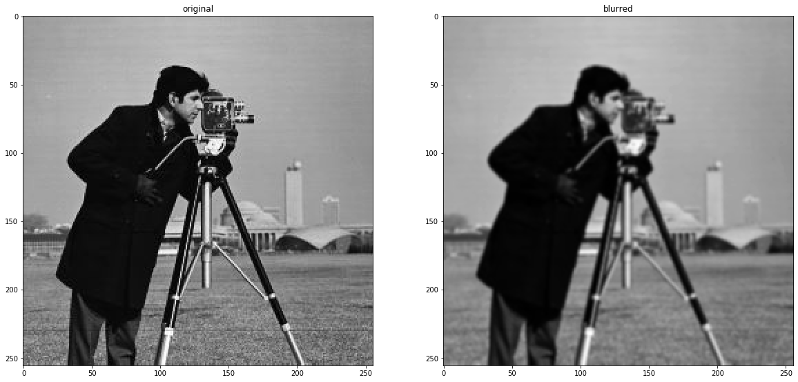


### 1.B Gradient Intensity


```python
class GradientIntensity:
    """
    We use Sobel filters to convolve over image (numpy ndarray) to calculate gradient intensity on both
    horizontal and vertical directions. Finally returns magnitude G and slope theta as follows:

    G = sqrt(Ix^2 + Iy^2)

    theta = arctan(Ix/Iy)

    We use these Sobel filters as default:

    Kx =
    [[-1 0 1],
    [-2 0 2],
    [-1 0 1]]

    Ky =
    [[1 2 1],
    [0 0 0],
    [-1 -2 -1]]

    """

    def __init__(self, hf=None, vf=None, init=True):
        """
        Initialize filters

        :param hf: Horizontal filter matrix -> numpy ndarray
        :param vf: Vertical filter matrix -> numpy ndarray
        :param init: whether initialize Sobel filters or initialize using user provided input -> default Sobel
        """

        if not init:
            self.hf = hf
            self.vf = vf
        else:
            self.hf = np.array(
                [[-1, 0, 1],
                 [-2, 0, 2],
                 [-1, 0, 1]])

            self.vf = np.array(
                [[1, 2, 1],
                 [0, 0, 0],
                 [-1, -2, -1]])

    def __call__(self, x):
        if not str(type(x)).__contains__('numpy'):
            raise ValueError('Invalid input. Please provide numpy ndarray image.')
        Ix = ndimage.filters.convolve(x, self.hf)
        Iy = ndimage.filters.convolve(x, self.vf)

        G = np.sqrt(np.power(Ix, 2)  + np.power(Iy, 2))
        G = G / G.max() * 255
        theta = np.arctan2(Iy, Ix)

        return G, theta
```


```python
to_grayscale = ToGrayscale()
image = np.array(to_grayscale(open_image('images/cameraman.jpg')), dtype=float)  # this 'float' took me 7 hours!
gaussian_noise = GaussianNoise()
image_blurred = gaussian_noise(image)
gradient_intensity = GradientIntensity()
image_grad, image_theta = gradient_intensity(image_blurred)

# plotting
fig, ax = plt.subplots(nrows=1, ncols=3, figsize=(20, 15))
ax[0].set_title('blurred')
ax[1].set_title('grad')
ax[2].set_title('theta')
ax[0].imshow(image_blurred, cmap='gray')
ax[1].imshow(image_grad, cmap='gray')
ax[2].imshow(image_theta, cmap='gray')
```


    <matplotlib.image.AxesImage at 0x17c7ac28550>


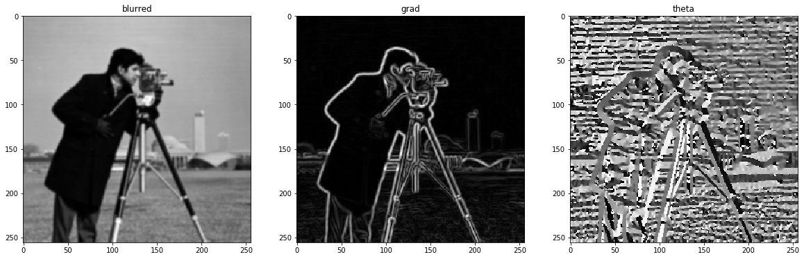


### 1.C Non-Max Suppression


```python
class NonMaxSuppression:
    """
    Get gradient of image w.r.t the filters and degree of gradients (theta) and keep
    most intensified pixel in each direction.
    Note: d_prime = d-180
    """

    def __init__(self):
        pass

    def __call__(self, grad_img, grad_dir):
        """
        Get non-max suppressed image by preserving most intensified pixels

        :param grad_img: Gradient image gathered by convolving filters on original image -> numpy ndarray
        :param grad_dir: Gradient directions gathered by convolving filters on original image -> numpy ndarray
        :return: Soft-edge numpy ndarray image
        """

        z = np.zeros(shape=grad_img.shape, dtype=np.int32)

        for h in range(grad_img.shape[0]):
            for v in range(grad_img.shape[1]):
                degree = self.__angle__(grad_dir[h][v])

                try:
                    if degree == 0:
                        if grad_img[h][v] >= grad_img[h][v - 1] and grad_img[h][v] >= grad_img[h][v + 1]:
                            z[h][v] = grad_img[h][v]
                    elif degree == 45:
                        if grad_img[h][v] >= grad_img[h - 1][v + 1] and grad_img[h][v] >= grad_img[h + 1][v - 1]:
                            z[h][v] = grad_img[h][v]
                    elif degree == 90:
                        if grad_img[h][v] >= grad_img[h - 1][v] and grad_img[h][v] >= grad_img[h + 1][v]:
                            z[h][v] = grad_img[h][v]
                    elif degree == 135:
                        if grad_img[h][v] >= grad_img[h - 1][v - 1] and grad_img[h][v] >= grad_img[h + 1][v + 1]:
                            z[h][v] = grad_img[h][v]
                except IndexError as exc:
                    # Handle boundary index errors
                    pass
        return z

    @staticmethod
    def __angle__(a):
        """
        Convert gradient directions in radian to 4 possible direction in degree system

        :param a: Radian value of gradient direction numpy ndarray matrix
        :return: A int within {0, 45, 90, 135}
        """
        angle = np.rad2deg(a) % 180
        if (0 <= angle < 22.5) or (157.5 <= angle < 180):
            angle = 0
        elif 22.5 <= angle < 67.5:
            angle = 45
        elif 67.5 <= angle < 112.5:
            angle = 90
        elif 112.5 <= angle < 157.5:
            angle = 135
        return angle
```


```python
non_max_suppression = NonMaxSuppression()
image_non_max = non_max_suppression(image_grad, image_theta)

# plotting
fig, ax = plt.subplots(nrows=1, ncols=2, figsize=(20, 15))
ax[0].imshow(image_grad, cmap='gray')
ax[1].imshow(image_non_max, cmap='gray')
ax[0].set_title('grad image')
ax[1].set_title('non max suppressed')
plt.show()


```


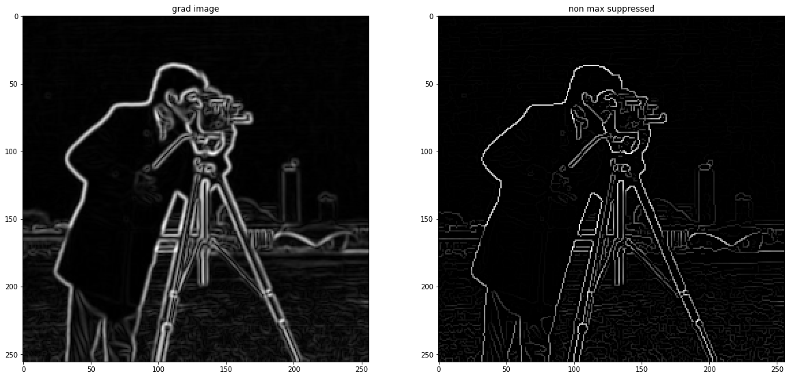


### 1.D Thresholding


```python
class Thresholding:
    def __init__(self, high_threshold = 90, low_threshold = 30):
        self.high_threshold = high_threshold
        self.low_threshold = low_threshold
        self.weak = 29
        self.strong = 255
        self.flag = self.weak*9

    def _threshold_image(self, image):
        thresholded = np.empty(image.shape)
        thresholded[np.where(image>self.high_threshold)] = self.strong
        thresholded[np.where(((image>self.low_threshold) & (image<=self.high_threshold)))] = self.weak
        return thresholded

    def __call__(self, image):
        thresholded = self._threshold_image(image)
        for i in range(thresholded.shape[0]):
            for j in range(thresholded.shape[1]):
                if thresholded[i, j] == self.weak:
                    if np.sum(thresholded[i-1:i+2, j-1:j+2]) > self.flag:
                        thresholded[i ,j] = self.strong
                    else:
                        thresholded[i ,j] = 0
        return thresholded

```


```python
thresholding = Thresholding()
thresholded = thresholding(image_non_max)

# plotting
fig, ax = plt.subplots(nrows=1, ncols=2, figsize=(20, 15))
ax[0].imshow(image_non_max, cmap='gray')
ax[1].imshow(thresholded, cmap='gray')
ax[0].set_title('non max suppressed')
ax[1].set_title('thresholded')

plt.show()
```


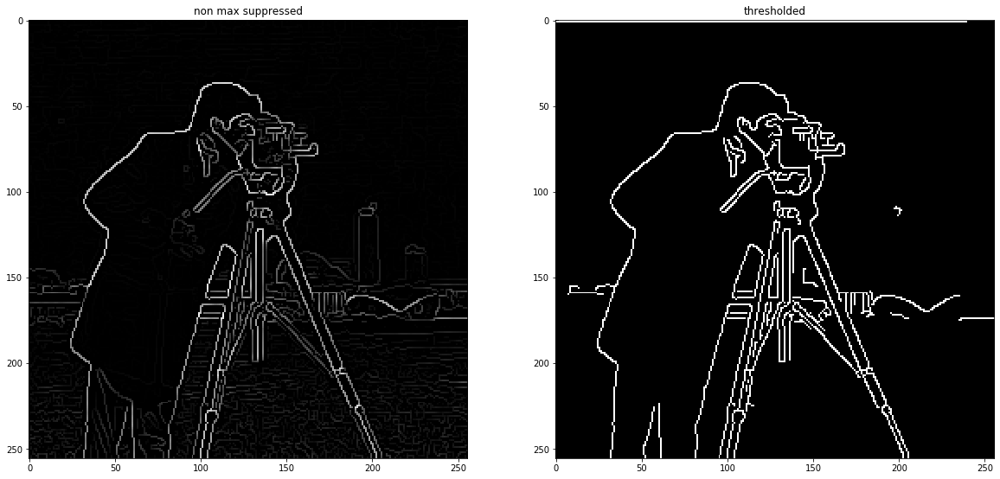


```python
image = cv2.imread('images/cameraman.jpg', 0).astype(float)
image_blurred = GaussianNoise()(image)
image_grad, image_theta = GradientIntensity()(image_blurred)
image_suppressed = NonMaxSuppression()(image_grad, image_theta)
image_final = Thresholding()(image_suppressed)

# plotting
fig, ax = plt.subplots(nrows=1, ncols=2, figsize=(20, 15))
ax[0].imshow(image, cmap='gray')
ax[1].imshow(image_final, cmap='gray')
ax[0].set_title('input')
ax[1].set_title('canny edges')

plt.show()
```


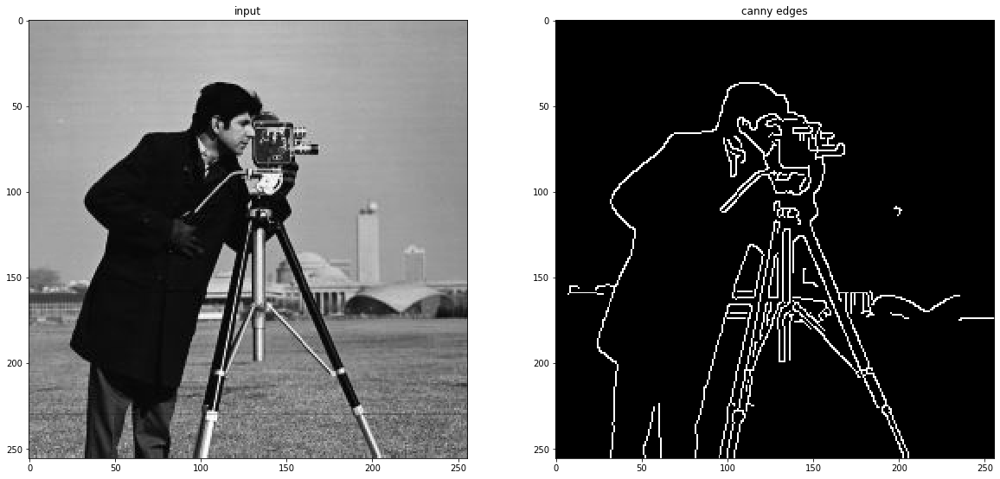


## 2 Straight Line Detector
1. Assign each edge to a direction
2. Getting edgelets using connected components
3. Compute straightness and theta
4. Threshold
5. Test


```python
image = np.ones((10, 10), dtype=np.float) * 255
image[:, 5:] = 0
plt.imshow(image, cmap='gray')
image_blurred = GaussianNoise()(image)
image_grad, image_theta = GradientIntensity()(image_blurred)
image_suppressed = NonMaxSuppression()(image_grad, image_theta)
image_final = Thresholding()(image_suppressed)
image_final[image_final <= 0] = 0
image_final[image_final > 0] = 255
image_final = image_final.astype(np.uint8)
```


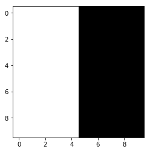


### 2.A Assign each edge to a direction


```python
def assign_direction(grad_directions):
    """
    Assign each gradian direction to one of 4 discrete values
    
    :param grad_directions: theta values of gradients of canny edge detector
    :return: Directions using degrees only in 4 discrete values
    """
    angle = np.rad2deg(grad_directions) % 180
    angle[np.logical_or(np.logical_and(angle < 22.5, 0 <= angle),
                    np.logical_and(angle <= 180, 157.5 <= angle))] = 0
    angle[np.logical_and(angle < 67.5, 22.5 <= angle)] = 45
    angle[np.logical_and(angle < 112.5, 67.5 <= angle)] = 90
    angle[np.logical_and(angle < 157.5, 112.5 <= angle)] = 135
    return angle.astype(np.uint8)
directions = assign_direction(image_theta)
plt.imshow(directions, cmap='gray')
```


    <matplotlib.image.AxesImage at 0x1c5e325ebe0>


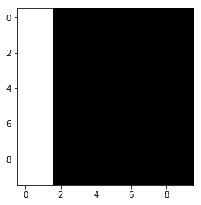


### 2.B Getting edgelets using connected components


```python
from scipy.ndimage import measurements

ANGLES = [0, 45, 90, 135]

def get_connected_components(directions, angles):
    """
    Computes connected components of each direction in angles
    
    :param direction: Direction of gradients matrix
    :param angles: possible angles of given direction matrix
    """
    structure = np.array([[0,1,0], [1,1,1], [0,1,0]])  # + form connected components
    connected_components = {}
    for a in ANGLES:
        connected_components[str(a)] = measurements.label((directions == a)*1)[0]
    return connected_components

connected_components = get_connected_components(directions, ANGLES)
plt.imshow(connected_components['90'], cmap='gray')
```


    <matplotlib.image.AxesImage at 0x1c5e32b28d0>


### 2.C Compute straightness and theta


```python
def raw_moment(data, iord, jord):
    nrows, ncols = data.shape
    y, x = np.mgrid[:nrows, :ncols]
    data = data * x**iord * y**jord
    return data.sum()

def intertial_axis(data):
    """
    Calculates the covariance matrix of image
    
    :param image: data
    :return: covariance matrix
    """
    data_sum = data.sum()
    m10 = raw_moment(data, 1, 0)
    m01 = raw_moment(data, 0, 1)
    x_bar = m10 / (data_sum+1e-10)
    y_bar = m01 / (data_sum+1e-10)
    u11 = (raw_moment(data, 1, 1) - x_bar * m01) / (data_sum+1e-10)
    u20 = (raw_moment(data, 2, 0) - x_bar * m10) / (data_sum+1e-10)
    u02 = (raw_moment(data, 0, 2) - y_bar * m01) / (data_sum+1e-10)
    cov = np.array([[u20, u11], [u11, u02]])
    return cov

def get_cov_matrices(connected_components, angles):
    """
    Computes covariance matrix of given connected components of direction of gradients
    
    :param connected_components: connected_components dictionary of gradient directions
    :param angles: possible angles of given direction matrix
    """
    
    cov_matrices = {}
    for a in ANGLES:
        n_components = np.max(connected_components[str(a)])
        cov_comp = np.zeros((n_components, 2, 2))
        for i in range(n_components):
             cov_comp[i,:,:] = intertial_axis(connected_components[str(a)]==i)
        cov_matrices[str(a)] = cov_comp
    return cov_matrices

cov_matrices = get_cov_matrices(connected_components, ANGLES)
cov_matrices['90']
```


    array([[  2.50000000e-01,   1.12496679e-11],
           [  1.12496679e-11,   8.25000000e+00]])


```python
def get_eigens(cov_matrices, angles):
    """
    Computes eigen vector and eigen values of covariance matrices for each direction in angles
    
    :param cov_matrices: covariance matrices of connected components
    :param angles: possible angles of given direction matrix
    """

    eigvals = {}
    eigvecs = {}
    for a in ANGLES:
        n_components = cov_matrices[str(a)].shape[0]
        eigvals_comp = np.zeros((n_components, 2,))
        eigvecs_comp = np.zeros((n_components, 2, 2))
        for i in range(n_components):
            eigvals_comp[i,:], eigvecs_comp[i,:,:]= np.linalg.eigh(cov_matrices[str(a)][i])
        eigvals[str(a)], eigvecs[str(a)] = eigvals_comp, eigvecs_comp
    return eigvals, eigvecs

eigvals, eigvecs = get_eigens(cov_matrices, ANGLES)
```

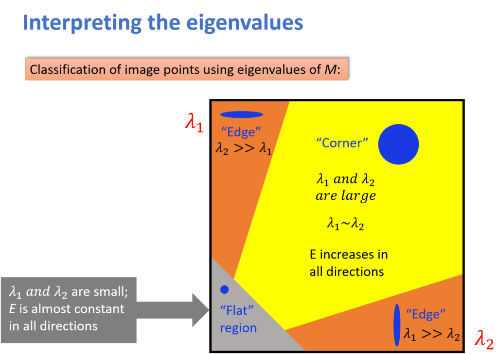


```python
def get_theta_conf(eigvals, eigvecs, angles):
    """
    Computes theta(direction) and confidence degrees of lines using eigen matrices
    
    :param eignvecs: Eigen vectors of covariance matrix of each direction
    :param eignvals: Eigen values of covariance matrix of each direction
    :param angles: possible angles of given direction matrix
    """

    thetas = {}
    confidences = {}

    for a in ANGLES:
        n_components = eigvals[str(a)].shape[0]
        thetas_comp = np.zeros((n_components, 1))
        confidences_comp = np.zeros((n_components, 1))
        for i in range(n_components):
            thetas_comp[i,:] = np.rad2deg(np.arctan2(eigvecs[str(a)][i][1,1], eigvecs[str(a)][i][0,1]))
            confidences_comp[i,:] = eigvals[str(a)][i][1] / (eigvals[str(a)][i][0]+1e-10)
        thetas[str(a)] = thetas_comp
        confidences[str(a)] = confidences_comp
    return thetas, confidences

thetas, confidences = get_theta_conf(eigvals, eigvecs, ANGLES)
print(thetas['90'][0])
print(confidences['90'][0])
```

    89.9999999999
    32.999999987
    

### 2.D Threshold


```python
threshold = 5

def threshold_conf(confidences, threshold, angles):
    """
    Thresholds each confidence of each direction for all directions in angles
    
    :param confidences: confidence degrees of lines using eigen matrices
    :param threshold: threshold value for confidence score
    :param angle: possible angles of given direction matrix
    """

    strong_confs = {}
    for a in ANGLES:
        n_components = confidences[str(a)].shape[0]
        strong_conf_comp = np.zeros((n_components, 1))
        for i in range(n_components):
            strong_conf_comp[i,:] = 1 if confidences[str(a)][i] > threshold else 0
        strong_confs[str(a)] = strong_conf_comp
    return strong_confs

strong_confs = threshold_conf(confidences, threshold, ANGLES)
strong_confs
```


    {'0': False, '45': False, '90': True, '135': False}


### 2.E Test


```python
image = cv2.imread('images/cameraman.jpg', 0).astype(float)
image_blurred = GaussianNoise()(image)
image_grad, image_theta = GradientIntensity()(image_blurred)
image_suppressed = NonMaxSuppression()(image_grad, image_theta)
image_final = Thresholding()(image_suppressed)
image_final[image_final< 1] = 0 
image_final[image_final> 1] = 255
image_final = image_final.astype(np.uint8)
plt.imshow(image_final, cmap='gray')
```


    <matplotlib.image.AxesImage at 0x1c5e330d390>


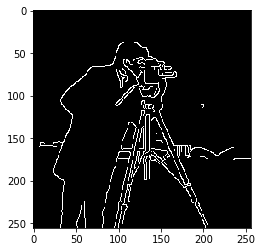


```python
from copy import deepcopy
image_ = deepcopy(image_final)
```


```python
directions = assign_direction(image_theta)
directions = np.multiply(directions, image_final==255)  # mask out non-edge directions
plt.imshow(directions, cmap='gray')
```


    <matplotlib.image.AxesImage at 0x1c5e4afd240>


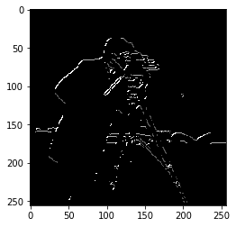


```python
ANGLES = [0, 45, 90, 135]
connected_components = get_connected_components(directions, ANGLES)

plt.figure(figsize=(20, 20))

for i,a in enumerate(ANGLES):
    plt.subplot(1,4, int(i+1))
    plt.imshow(connected_components[str(a)], cmap='gray')
    plt.title('#comp'+str(np.max(connected_components[str(a)])))
```


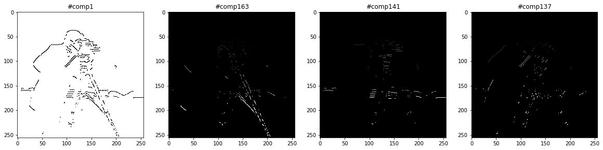


```python
cov_matrices = get_cov_matrices(connected_components, ANGLES)
eigvals, eigvecs = get_eigens(cov_matrices, ANGLES)
```


```python
thetas, confidences = get_theta_conf(eigvals, eigvecs, ANGLES)

print('thetas:')
for a in ANGLES:
    print(thetas[str(a)].shape)
print('\n\nconfidences:')
for a in ANGLES:
    print(confidences[str(a)].shape)
```

    thetas:
    (1, 1)
    (163, 1)
    (141, 1)
    (137, 1)
    
    
    confidences:
    (1, 1)
    (163, 1)
    (141, 1)
    (137, 1)
    


```python
threshold = np.mean([np.mean(confidences[str(a)]) for a in ANGLES])/10
strong_confs = threshold_conf(confidences, threshold, ANGLES)

for a in ANGLES:
    print('# of connected components with enough conf for {} degree: {}'.format(a, int(np.sum(strong_confs[str(a)]))))
```

    # of connected components with enough conf for 0 degree: 0
    # of connected components with enough conf for 45 degree: 8
    # of connected components with enough conf for 90 degree: 61
    # of connected components with enough conf for 135 degree: 4
    


```python
connected_components['90'].shape
```


    (256, 256)


```python
strong_confs['90'].nonzero()[0]
```


    array([  1,   2,   3,   4,   5,   6,   7,  10,  11,  15,  19,  20,  21,
            22,  25,  27,  28,  29,  31,  34,  36,  37,  38,  39,  43,  46,
            47,  48,  50,  51,  52,  53,  55,  57,  59,  61,  68,  75,  76,
            77,  78,  81,  82,  91,  92,  93,  94,  95,  96,  97, 100, 103,
           108, 112, 116, 120, 123, 124, 125, 127, 135], dtype=int64)


```python
plt.imshow(connected_components['90']==46, cmap='gray')
```


    <matplotlib.image.AxesImage at 0x1c5e96e4e10>


```python
plt.imshow(connected_components['45']==51, cmap='gray')
```


    <matplotlib.image.AxesImage at 0x1c5e9796f28>


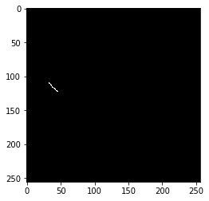

